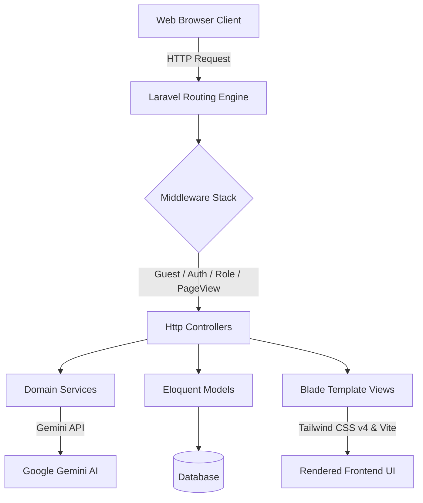

# Atomni Pro — Design Documentation

Atomni Pro is a modern, high-performance Content Management System (CMS), Careers Platform, and Digital Portal built on the **Laravel 12** framework. It features robust role-based administration, a dynamic Tailwind CSS v4 frontend, and rich AI-driven content analysis, taxonomy, and SEO/AEO scoring capabilities.

---

## 1. System Architecture Overview

The application is structured around a classic Model-View-Controller (MVC) pattern, enhanced by service-layer components for specialized operations (like AI and taxonomy processing).



### Key Framework Features Used:
- **Framework**: Laravel 12.x (with PHP 8.2+)
- **Frontend Assets**: Tailwind CSS v4.0 and Vite
- **Asset Bundler**: Laravel Vite Plugin
- **Performance / Metrics**: Laravel Pulse (included for real-time monitoring)
- **Monitoring / Error Tracking**: Sentry (Laravel Integration)
- **Backups**: Spatie Laravel Backup

---

## 2. Core Modules & Database Schema

The system database is organized around 22 models mapping to distinct tables, covering content delivery, user/admin roles, career tracking, settings, and navigation.

```mermaid
erDiagram
    USERS {
        bigint id PK
        string name
        string email
        string password
        string role "super_admin | editor | author"
        bigint team_member_id FK
    }
    POSTS {
        bigint id PK
        bigint author_id FK
        bigint category_id FK
        string title
        string slug
        text content
        text excerpt
        text tldr
        json faqs
        string featured_image
        string status "draft | published | scheduled | archive"
        boolean is_featured
        boolean is_sponsored
        integer views_count
        decimal trending_score
        integer seo_score
        integer aeo_score
        integer geo_score
        integer reading_time
        datetime published_at
        boolean kill_switch
        string redirect_url
    }
    POST_META {
        bigint id PK
        bigint post_id FK
        string meta_title
        string meta_description
    }
    CATEGORIES {
        bigint id PK
        bigint parent_id FK
        string name
        string slug
        string description
    }
    TAGS {
        bigint id PK
        string name
        string slug
    }
    LOCATIONS {
        bigint id PK
        string name
        string slug
    }
    COMMENTS {
        bigint id PK
        bigint post_id FK
        string author_name
        string author_email
        text content
        boolean is_approved
    }
    TEAM_MEMBERS {
        bigint id PK
        string name
        string role
        string bio
        string avatar
        boolean is_founding_member
    }
    JOB_POSTINGS {
        bigint id PK
        string title
        string slug
        text description
        string status "draft | active | closed"
    }
    JOB_APPLICATIONS {
        bigint id PK
        bigint job_posting_id FK
        string name
        string email
        string resume_path
    }
    DONORS {
        bigint id PK
        string name
        string email
        decimal amount
    }
    MENUS {
        bigint id PK
        string name
        string location "header | footer | sidebar"
    }
    MENU_ITEMS {
        bigint id PK
        bigint menu_id FK
        bigint parent_id FK
        string title
        string url
        integer order
    }
    PAGES {
        bigint id PK
        string title
        string slug
        text content
        string status
        string meta_title
        string meta_description
    }
    MEDIA {
        bigint id PK
        bigint user_id FK
        string file_name
        string file_path
        string mime_type
        integer size
        string collection_name
        string alt_text
        integer width
        integer height
    }
    POST_VIEWS {
        bigint id PK
        bigint post_id FK
        string ip_address
        string user_agent
        datetime viewed_at
        string session_id
    }
    SETTINGS {
        bigint id PK
        string key
        text value
        string type
        string group
    }
    NEWSLETTERS {
        bigint id PK
        string subject
        text content
        string status
        datetime sent_at
    }
    SUBSCRIBERS {
        bigint id PK
        string email
        string status
        datetime subscribed_at
        datetime unsubscribed_at
    }
    ADS {
        bigint id PK
        string title
        string slot
        string type
        text content
        string image_path
        string url
        boolean is_active
        integer clicks
        integer impressions
        datetime starts_at
        datetime ends_at
    }
    TRAFFIC_REPORTS {
        bigint id PK
        string path
        integer views
        integer unique_visitors
        decimal bounce_rate
        integer avg_time_on_page
        date report_date
    }
    CONTACT_QUERIES {
        bigint id PK
        string name
        string email
        string subject
        text message
        string status
        string ip_address
    }

    USERS ||--o{ POSTS : writes
    POSTS ||--|| POST_META : has
    POSTS }o--|| CATEGORIES : belongs_to
    POSTS }o--o{ TAGS : has_many_to_many
    POSTS }o--o{ LOCATIONS : has_many_to_many
    POSTS ||--o{ COMMENTS : has
    USERS ||--o| TEAM_MEMBERS : represents
    JOB_POSTINGS ||--o{ JOB_APPLICATIONS : receives
    MENUS ||--o{ MENU_ITEMS : contains
    USERS ||--o{ MEDIA : uploads
    POSTS ||--o{ POST_VIEWS : tracks
```



### Database Entities Details:
1. **Content**: `posts`, `post_meta`, `comments`, `post_views`, `traffic_reports`, `pages`, `media`
2. **Taxonomies**: `categories` (hierarchical), `tags`, `locations`
3. **Careers**: `job_postings`, `job_applications`
4. **Administration**: `users`, `team_members`
5. **Marketing & Settings**: `settings`, `newsletters`, `subscribers`, `ads`, `donors`, `contact_queries`
6. **Navigation**: `menus`, `menu_items`

---

## 3. Core Features

### A. Frontend Experience
- **Dynamic Homepage**: Features trending posts, sponsored posts, category filter sections, and featured layouts.
- **Search & Exploration**: Real-time search suggestions endpoint (`/api/search/suggestions`) and custom search explorer (`/search`).
- **Interactive Articles**: Displays content alongside a quick-view TL;DR, automated FAQs, tags, locations, category paths, and approved comments submission.
- **Sitemap & RSS Feeds**: Automated, lightweight XML files (`/sitemap.xml` and `/feed.xml`) constructed with session and CSRF middlewares bypassed for maximum load speed.
- **Career Portal**: Browse current jobs (`/careers`), view requirements, and apply directly via custom form with secure file uploads.
- **Marketing Pages**: Landing templates including `/use-cases/client-intake-automation`, `/use-cases/document-processing-automation`, `/compare/atomni-vs-zapier`.

### B. Admin Panel
Organized by roles with granular access controls (via `role` middleware).

- **Role Management**:
  - `super_admin`: Full access to Settings, Database tools, Donors, Newsletter management, and User accounts.
  - `editor`: Full content control (Posts, Pages, Categories, Media, Team profiles).
  - `author`: Creation and management of personal posts and media attachments.

- **AI Tools**:
  - **SEO & AEO Analysis**: Utilizes `gemini-2.5-flash-lite` to critique headlines, outline SEO enhancements, and formulate Answer Engine Optimization suggestions.
  - **Auto-Taxonomy Classification**: Bulk or single-post categorization, tag mapping, and geo-location classification via `gemini-1.5-flash`.
  - **FAQ Generator**: Automatically crafts 4 QA pairs targeting conversational search criteria (e.g., "What is", "How to") to optimize Perplexity/Google AI snippets.
  - **Alt Text Generator**: AI-driven generation of image alt tags for accessibility compliance.
  - **AI Trends**: Generate ideas and outlines for trending topics directly inside the admin panel.

- **Plagiarism Engine**: 
  - Uses a localized fuzzy matching algorithm comparing new content sentences with all existing posts in the archive (`similar_text`) to calculate an originality percentage.

- **System Tools**:
  - **Cache Manager**: Fast clearing of system and application cache.
  - **Import / Export**: Portability of system configurations and content data.
  - **Site Health Dashboard**: Summarizes server status, database state, and system configurations.
  - **RSS Importer**: Automatically pulls external article feeds to keep the database populated.

---

## 4. Technical Design Decisions

### 1. Heuristic & AI-Hybrid Scores
Instead of querying heavy AI APIs for basic grading, the system uses Eloquent mutators on the `Post` model to calculate local baseline scores:
- **SEO Score Heuristics**: Grades on title length (40-60 characters), word count ($\ge800$ words), H2/H3 header tags existence, featured image presence, and post excerpts.
- **AEO Score Heuristics**: Evaluates conversational question usage (headers ending in `?`), ordered/unordered list counts, presence of tables, short/digestible paragraphs (10-50 words), and structural introductory phrases (e.g., "In short", "The answer is").

For deep optimization, the admin triggers the Gemini API to supply specific, structured structural recommendations.

### 2. Performance Caching
To protect API rate limits and reduce loading times, AI-generated prompts (e.g., FAQ suggestions) are cached in Laravel's cache layer for **24 hours (86,400 seconds)**, keyed on content hashes.

### 3. Clean CSS Design Strategy
All layout files leverage Tailwind CSS v4.0 via `@tailwindcss/vite` integration, reducing boilerplate CSS files. Custom colors, transitions, and responsive grid layouts are declared natively within the templates.

---

## 5. Setup & Development Operations

The project uses Composer scripts to automate environment setups.

- **Initial Setup Command**:
  ```bash
  composer run setup
  ```
  *(Installs Composer dependencies, copies `.env`, runs key generation, migrates database, installs npm packages, and builds frontend assets).*

- **Local Dev Server**:
  ```bash
  composer run dev
  ```
  *(Runs `php artisan serve`, listens to queue jobs, monitors log outputs via Laravel Pail, and starts the Vite dev server concurrently).*
